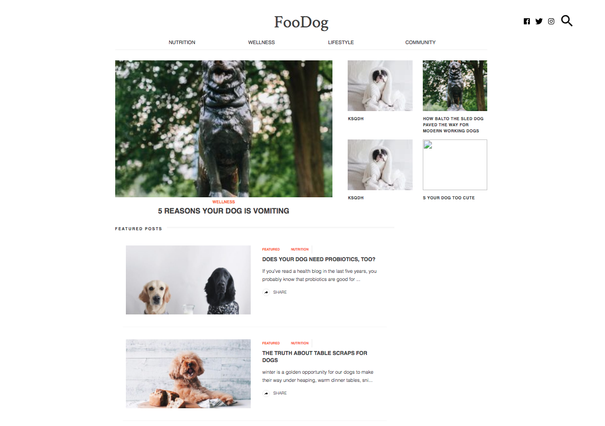
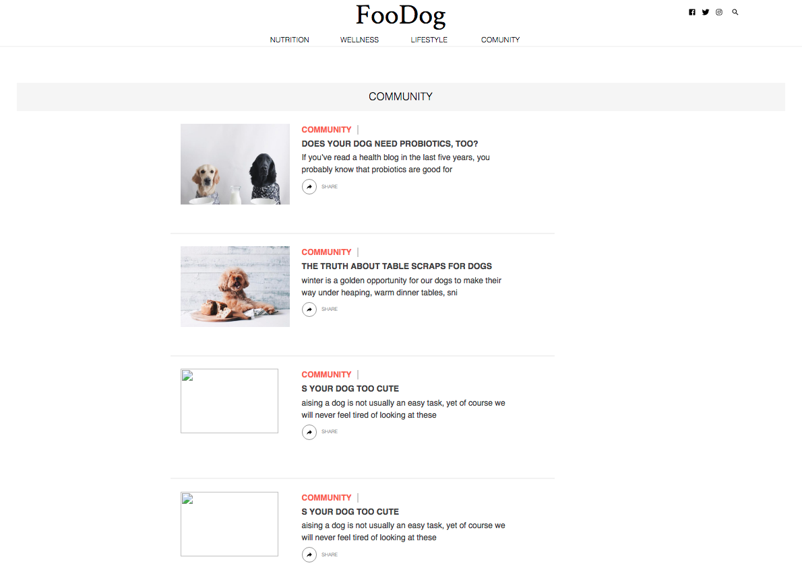
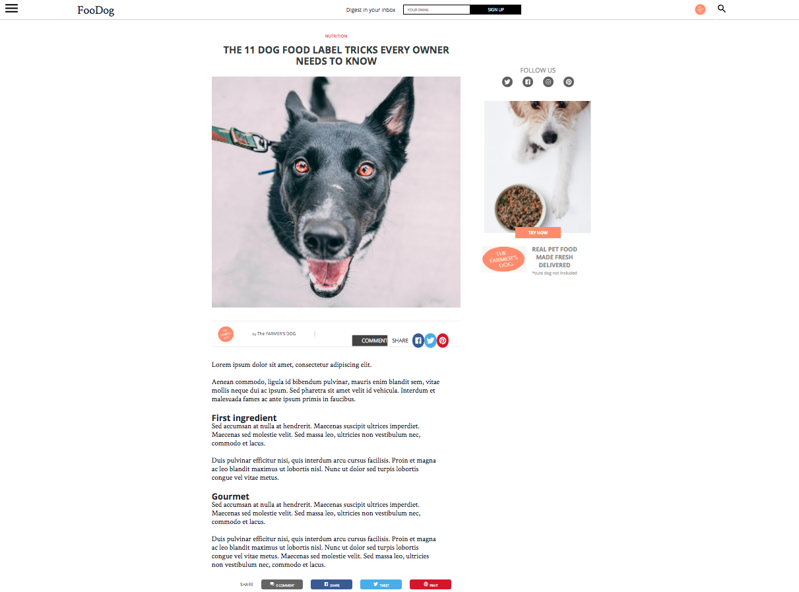

FooDog 
======

Welcome on the Github of the "__FooDog__" website project.  

## Developers

- [Lily Danhaive](https://github.com/LilyDa08)
- [Marco Tampieri](https://github.com/MarcoTampieri)
- [Jeremy Vantighem](https://github.com/jevanty)
- [Damian Szacun](https://github.com/damianszn)

We're four junior web developers.

## Project

FooDog is a project talking about __dogs food__.  
The client already have a website, but want to increase his online presence through a blog.   
We have to adapt to a detailed graphic charter and develop a responsive website, ready to be frequently updated.

## Repo

We're dynamically assigning each other tasks, but we started by splitting between us the project.   
Everyone took a different page template and we regularly do small debriefings to keep the work consistent.  
>That's why in this repo you can find a folder with all our mockups and folders with our respective pages designs.

## Progression

We did all the mockups and started the mobile versions development.  
You can keep exact track of our work in the "Projects" part.  
### 25th november
the design is done for the 3 main pages.
we are now working on the AJAX HTTPRequest.

## Details

We're all interns at [Becode](https://www.becode.org/) and started the development learning in early september.  
This project is an exercise to confirm our __HTML__ / __CSS__ / __Javascript__ skills, and introduce/continue the teaching of many skills :  
- Bootstrap
- Ajax, HTTP Requests and Responses
- Team management, the use of tools like Kanban
- Development work splitting
- Respecting customer demands

## Date & Time

We started on 6 november 2018. We have + - two weeks to finish the project.  
README edit : 8 november 2018.
README edit : 25 november 2018.

## Design

The development is still in progress, but here are our mockups for each page type.

  
---
  
---
 
--- 
